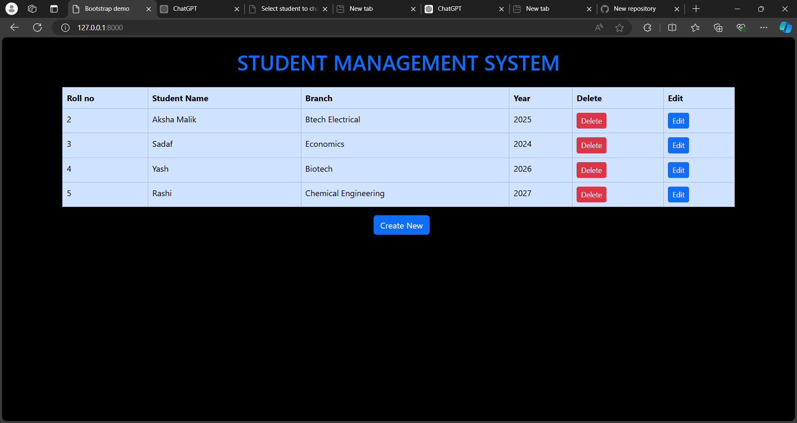
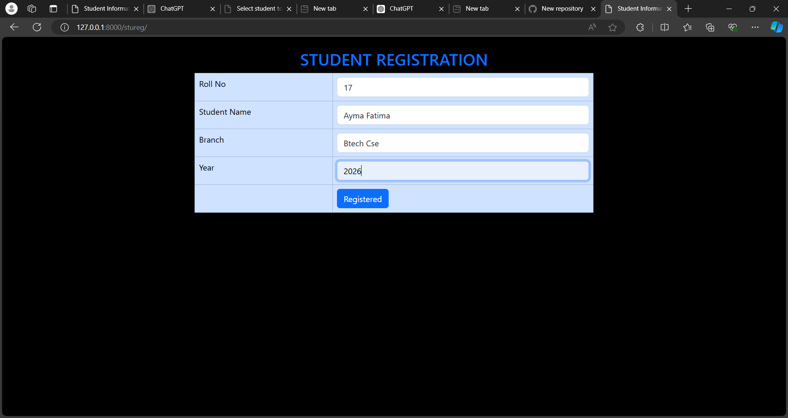
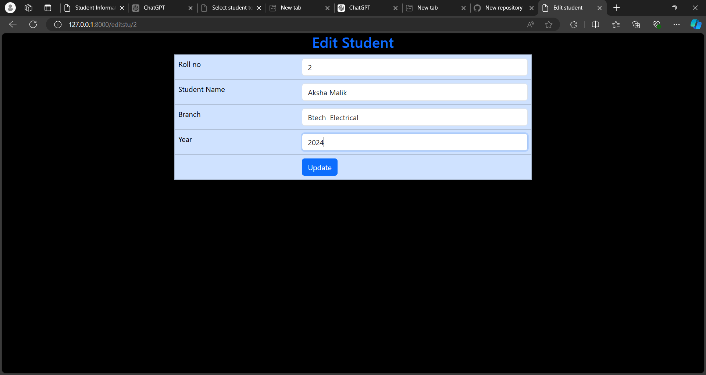

#Student Management System
The Student Management System is a Django-based web application designed for managing student records. It allows users to create, update, and delete student data using an intuitive web interface. This project demonstrates Django’s capabilities in handling CRUD (Create, Read, Update, Delete) operations with dynamic data management, making it a useful tool for educational institutions.

##Features
-Django Integration: The application leverages Django for both backend functionality and front-end rendering, resulting in a robust and responsive student management system.

-CRUD Operations: Easily create, update, and delete student records with four key fields:

Name
Roll No
Branch
Year
-Dynamic Data Management: The application dynamically handles student data, reflecting real-time updates when new data is added or existing data is modified.

-Form Validation: Built-in Django form validation ensures that user inputs are correctly formatted, ensuring the integrity of the student data.

-Bootstrap Integration: The front-end uses Bootstrap for styling, ensuring the UI is responsive and user-friendly across all devices.

##Requirements
Python
Django
Bootstrap (for styling)
HTML, CSS (for templates)

##Installation and Setup
Clone the repository:

bash
Copy code
git clone https://github.com/your-username/student-management-system.git
Navigate into the project directory:

bash
Copy code
cd student-management-system
Install dependencies:

bash
Copy code
pip install -r requirements.txt
Run database migrations:

bash
Copy code
python manage.py migrate
Start the development server:

bash
Copy code
python manage.py runserver
Access the system at http://127.0.0.1:8000/.

##Contributing
If you're interested in contributing to the Student Management System project, feel free to fork the repository and submit pull requests. Your contributions are highly welcome!

##License
The Student Management System is licensed under the MIT License, making it open for collaboration and reuse.

##Acknowledgements
Special thanks to the Django and Bootstrap development communities for their continuous support and resources.

